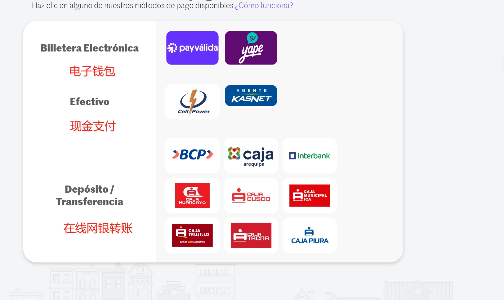

### 请求地址

| method | url                        |
| ------ | -------------------------- |
| POST   | /api/pay/payment/create/v1 |

### 头部信息（header）

| header参数                  | 入参参数描述  |
|---------------------------|---------|
| timestamp                 | 请求时间戳   |
| nonce                     | 随机值     |
| country                   | 国家码(PE) |
| app_code                  | app编号   |

### 支持支付方式列表（paymentType）

| 支付方式名称            | PaymentType (入参参数)             | 备注                         |
|-------------------|--------------------------------|----------------------------|
| checkout（支付链接收银台） | 101 | 该支付方式存在多次回调,商户务必处理正确的回调逻辑  |



#### additionalInfo （附加字段）字段说明:

##### 当支付方式为 101：checkout 支付链接收银台 时 additionalInfo 返回包含：

| 字段名      | 类型       | 长度 | 是否必传 | 说明     |
| ----------- |----------|----| -------- | -------- |
| paymentLink | String   | 32 | 是       | 支付链接 |

##### 

### 请求参数

| 字段            | 类型   | 必需  | 长度  | 描述                           |
| --------------- | ------ |-----|-----|------------------------------|
| merchantOrderNo | String | yes | 32  | 商户订单号                        |
| paymentType     | Int    | yes |     | 支付方式: 101 ：checkout（支付链接收银台） |
| amount          | String | yes | 20  | 代收金额(索尔)                     |
| expirationTime  | Long   | yes |     | 过期时间                         |
| realName        | String | yes | 50  | 用户姓名：大写，不包含特殊字符，50 个字符以内     |
| email           | String | yes | 50  | 用户邮箱：满足正则表达式即可               |
| phone           | String | yes | 9   | 电话号码 9 位数不包含区号               |
| sign            | String | yes |     | 签名                           |
| callbackUrl     | String | no  | 200 | 回调地址                         |

```json title="请求示例"
{
  "merchantOrderNo": "C27412415HkF6U9SnXRrxitBWD647lw7",
  "realName": "aaaaaa",
  "amount": "100",
  "callbackUrl": "http://test.domin.com",
  "paymentType": 101,
  "email": "1QWWQWQ2891@qq.com",
  "phone": "123456789",
  "sign": "YOUR SIGN",
  "expirationTime": 1717092000000
}
```

### 返回参数

| 字段            | 类型       | 必需 | 长度 | 描述                                                     |
| --------------- | ---------- | ---- | ---- | -------------------------------------------------------- |
| merchantOrderNo | String     | yes  | 32   | 商户订单号                                               |
| tradeNo         | String     | yes  | 32   | 平台订单号                                               |
| amount          | String     | yes  | 32   | 交易金额                                                 |
| paymentType     | Int        | yes  | 10   | 支付方式：101 checkout（支付链接收银台）                 |
| paymentInfo     | String     | yes  | 32   | 主要付款信息，返回的是实际用于付款的信息，例如：付款编号 |
| additionalInfo  | JSONObject | No   |      | 附加信息                                                 |
| status          | Int        | yes |    | 1-订单创建成功  3-失败               |
| errorMsg        | String     | no  |    | 错误信息,失败时返回                   |
#### 不同支付方式的响应示例：

#### 当 PaymentType 为 101 ：checkout（支付链接收银台）时：

```json
{
  "msg": "success",
  "code": 200,
  "data": {
    "amount": "100",
    "tradeNo": "TS2405220001MX0000048362685411",
    "merchantOrderNo": "C31412415HkF6U9SnXRrxitBWD647lw7",
    "paymentType": 101,
    "additionalInfo": {
      "thirdOrderNum": "123456789"
    },
    "paymentInfo": "sandbox-checkout.payvalida.com?token=eyJhbGciOiJIUzI1NiIsInR5cCI6IkpXVCJ9.eyJNRVJDSEFOVF9DRUwiOiIrNTE5MjQwNzA5MzMiLCJNRVJDSEFOVF9DT0RFIjozMjAxNCwiT1JERVJfQ09ERSI6MjQ2NDEyOSwiTUVSQ0hBTlRfRU1BSUwiOiJwYXltZW50LmxhdGFtQGdtYWlsLmNvbSIsIk1FUkNIQU5UX0xPR08iOiIiLCJNRVJDSEFOVF9VUkxfUkVUVVJOIjoiIiwiTUVSQ0hBTlRfTkFNRSI6IlBheW1lbnQgTGF0YW0gKFBFKSIsIkVYUElSQVRJT04iOiIzMC8wNS8yMDI0IiwiT1JERVJfQlJJRUYiOiJSZWNhdWRvIiwiT1JERVJfQ1VSUkVOQ1kiOiJQRU4iLCJPUkRFUl9BTU9VVCI6IjEwMC4wIiwiTUVSQ0hBTlRfSUQiOiJwYXltZW50bGF0YW0iLCJPUkRFUl9SRUZFUkVOQ0UiOiI5MDkyNjQ1MDI4NyIsIk9SREVSX01FVEhPRCI6IiIsIlVTRVJfREkiOiI3MDA0NTI0OTgiLCJVU0VSX1RZUEVfREkiOiJDQyIsIlVTRVJfTkFNRSI6ImFhYWFhYSIsIlJFRElSRUNUX1RJTUVPVVQiOiIzMDAwMDAiLCJNRVJDSEFOVF9URU1QTEFURSI6ImRlZmF1bHQiLCJleHAiOjE3MTcxMzE2MDAsImlzcyI6ImF1dGgwIn0.6nyMaIx1wUEa1MJJIO8jRFN6G7GXF1xnNAqLe0OJU_U",
    "status": 1
  },
  "success": true
}
```

####
