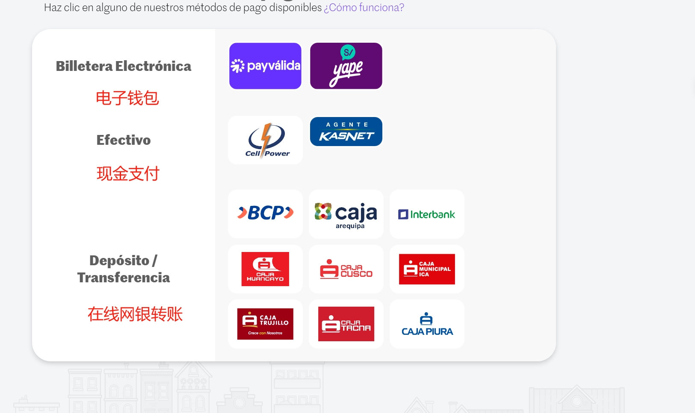

### 请求地址

| method | url                        |
| ------ | -------------------------- |
| POST   | /api/pay/payment/create/v1 |

## 支持支付方式列表（paymentType）

| 支付方式名称               | PaymentType (入参参数) |
| -------------------------- | ---------------------- |
| checkout（支付链接收银台） | 101                    |




#### additionalInfo （附加字段）字段说明：

##### 当支付方式为 101：checkout支付链接收银台 时 additionalInfo 返回包含：

| 字段名      | 类型       | 是否必传 | 说明     |
| ----------- | ---------- | -------- | -------- |
| paymentLink | String(32) | 是       | 支付链接 |

##### 

### 请求参数

| 字段            | 类型   | 必需 | 长度 | 描述                                         |
| --------------- | ------ | ---- | ---- | -------------------------------------------- |
| merchantOrderNo | String | yes  | 32   | 商户订单号                                   |
| paymentType     | Int    | yes  | 1    | 支付方式: 101 ：checkout（支付链接收银台）   |
| amount          | String | yes  |      | 代收金额(索尔)                               |
| expirationTime  | Long   | yes  |      | 过期时间                                     |
| realName        | String | yes  |      | 用户姓名：大写，不好含特殊字符，40个字符以内 |
| email           | String | yes  |      | 用户邮箱：满足正则表达式即可                 |
| phone           | String | yes  |      | 电话号码 9位数不包含区号                     |
| remark          | String | no   |      | 交易备注                                     |
| sign            | String | yes  |      | 签名                                         |
| callbackUrl     | String | yes  |      | 回调地址                                     |
| country         | String | yes  |      | "PE"                                         |

```json title="请求示例"
{
               "merchantOrderNo": "C27412415HkF6U9SnXRrxitBWD647lw7",
                "realName": "aaaaaa",
                "amount": "100",
                "callbackUrl": "http://192.168.110.138:8075/sys/dictionary/test",
                "paymentType": 101,
                "email": "1QWWQWQ2891@qq.com",
                "phone": "123456789",
                "sign": "YOUR SIGN",
                "expirationTime": 1717092000000,
                "timestamp": "1716276918582",
                "nonce": "Eppo2cbbVwWlN5ES0vAMPAbgxiQXXDdw",
                "country": "PE",
                "app_code": "YOUR APPCODDE"
    
}
```

### 返回参数

| 字段            | 类型       | 必需 | 长度 | 描述                                                     |
| --------------- | ---------- | ---- | ---- | -------------------------------------------------------- |
| merchantOrderNo | String     | yes  | 32   | 商户订单号                                               |
| tradeNo         | String     | yes  | 32   | 平台订单号                                               |
| amount          | String     | yes  | 32   | 交易金额                                                 |
| paymentType     | Int        | yes  | 10   | 支付方式：101 checkout（支付链接收银台）                 |
| paymentInfo     | String     | yes  | 32   | 主要付款信息，返回的是实际用于付款的信息，例如：付款编号 |
| additionalInfo  | JSONObject | No   |      | 附加信息                                                 |

#### 不同支付方式的响应示例：


#### 当 PaymentType 为 101 ：checkout（支付链接收银台）时：

```json
{
  "msg": "success",
  "code": 200,
  "data": {
    "amount": "100",
    "tradeNo": "TS2405220001MX0000048362685411",
    "merchantOrderNo": "C31412415HkF6U9SnXRrxitBWD647lw7",
    "paymentType": 101,
    "additionalInfo": {
        "paymentLink": "sandbox-checkout.payvalida.com?token=eyJhbGciOiJIUzI1NiIsInR5cCI6IkpXVCJ9.eyJNRVJDSEFOVF9DRUwiOiIrNTE5MjQwNzA5MzMiLCJNRVJDSEFOVF9DT0RFIjozMjAxNCwiT1JERVJfQ09ERSI6MjQ2NDEyOSwiTUVSQ0hBTlRfRU1BSUwiOiJwYXltZW50LmxhdGFtQGdtYWlsLmNvbSIsIk1FUkNIQU5UX0xPR08iOiIiLCJNRVJDSEFOVF9VUkxfUkVUVVJOIjoiIiwiTUVSQ0hBTlRfTkFNRSI6IlBheW1lbnQgTGF0YW0gKFBFKSIsIkVYUElSQVRJT04iOiIzMC8wNS8yMDI0IiwiT1JERVJfQlJJRUYiOiJSZWNhdWRvIiwiT1JERVJfQ1VSUkVOQ1kiOiJQRU4iLCJPUkRFUl9BTU9VVCI6IjEwMC4wIiwiTUVSQ0hBTlRfSUQiOiJwYXltZW50bGF0YW0iLCJPUkRFUl9SRUZFUkVOQ0UiOiI5MDkyNjQ1MDI4NyIsIk9SREVSX01FVEhPRCI6IiIsIlVTRVJfREkiOiI3MDA0NTI0OTgiLCJVU0VSX1RZUEVfREkiOiJDQyIsIlVTRVJfTkFNRSI6ImFhYWFhYSIsIlJFRElSRUNUX1RJTUVPVVQiOiIzMDAwMDAiLCJNRVJDSEFOVF9URU1QTEFURSI6ImRlZmF1bHQiLCJleHAiOjE3MTcxMzE2MDAsImlzcyI6ImF1dGgwIn0.6nyMaIx1wUEa1MJJIO8jRFN6G7GXF1xnNAqLe0OJU_U"
    },
    "paymentInfo": "90926450287",
    "status": 1
},
  "success": true,
  "present": true
}
```

#### 
